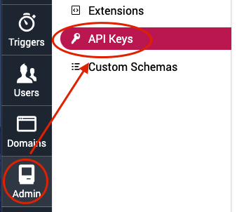
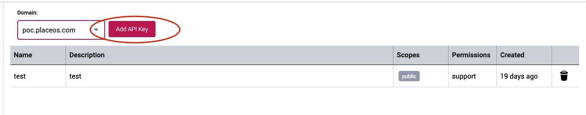
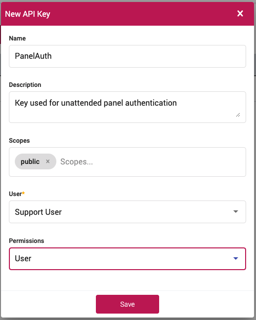
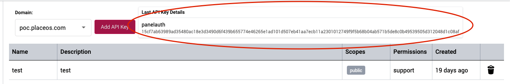
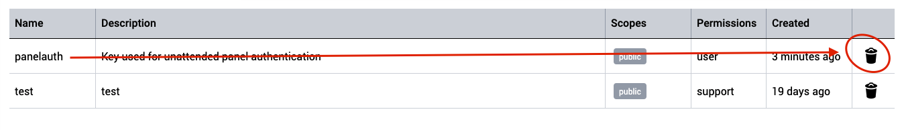

## Overview

PlaceOS can generate API Keys for authenticated access.

The API keys can be used for:
* [Unattended Panel Access](../user-interfaces/panel-login.md)
* Accessing the [PlaceOS API](././reference/api.md)
* Using the [Real-time Websocket](././reference/websocket.md)

## Prerequisites

- Administrator access to your PlaceOS Backoffice

## Generate API Key

1. Login to PlaceOS Backoffice
2. Navigate to the Admin Tab
3. Select API Keys  
  
4. Select the domain the API Key will belong to
5. Any existing API Keys will be shown in the list
6. Click `Add API Key`  

7. Enter the required information:
    - Name: Suitable name for the API Key
    - Description: What the key will be used for (useful for other adminnistrators)
    - Scopes: Select from available scopes (see available scopes [below](#available-scopes))
    - User: The user in which the API Key will emulate
    - Permissions: Permission level assigned to the API Key (see permission details [below](#available-permissions))  
  
8. Click Save
9. The new API Key will be shown once after it is saved, you will not be able to view it again  
  

### Available Scopes

Available Scopes for API Keys are:

//TODO

### Available Permissions

## Using the API Key

API Keys are passed in the header of the request:

`X-API-Key: <token>`

## Removing an API Key

1. Navigate to the API Key Page in Backoffice located in the Admin Tab.
2. Click the trash icon to remove the key.  
  