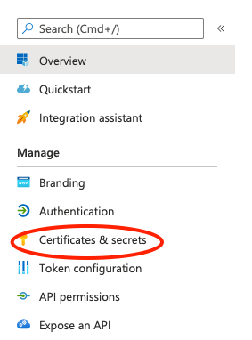
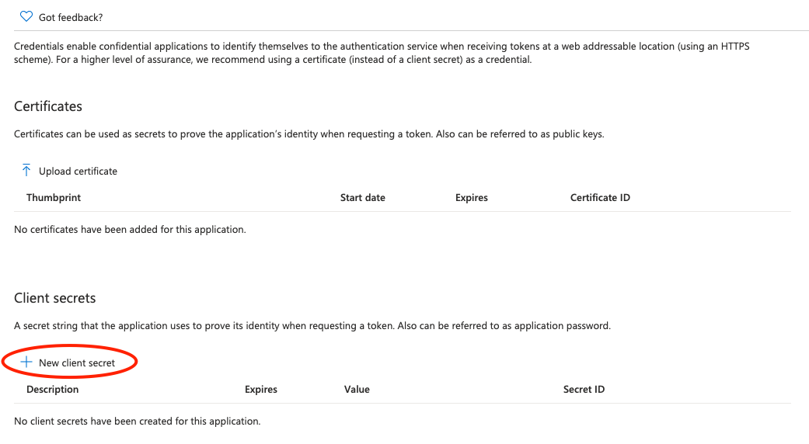
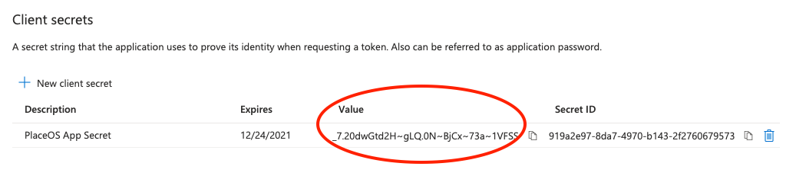
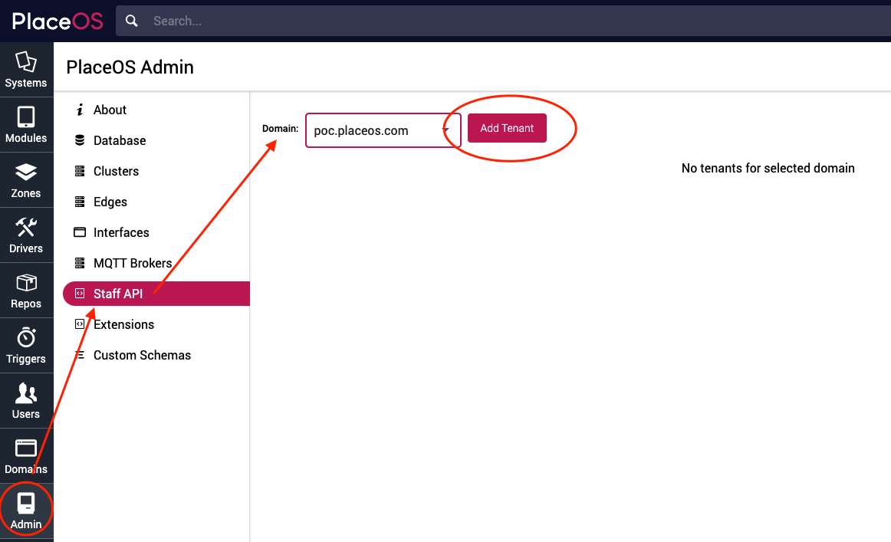
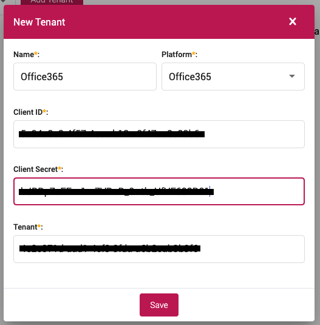

The Staff API gives PlaceOS the ability to interact with Calendar and User Resources.

To integrate room booking into your existing calendar environment the Staff API must be configured.

When configured, PlaceOS will be able to create, edit, update and delete calendar bookings for users and resources.

To show room status on floor maps, the [PlaceOS Calendar driver must also be configured](./placeos-calendar.md).

To enable room bookings, the [PlaceOS Bookings driver must be also configured](./placeos-bookings.md).

## Prerequisites 

- Access on Microsoft Azure or Google Cloud Console & Workspace to create apps and API permissions
- Administrator access to your PlaceOS Backoffice

## Configure Providers

<!--tabs start-->
## Microsoft Azure (365)

To use Staff API with 365 you will need to create an Application in App Registration.

You may have already completed this step if you have configured [SAML for Azure](../authentication/configure-saml.md).

If you have already created an app, you ca skip to Grant Graph API Permissions.

If not, you will need to create a new App Registration on Azure.

#### Create Azure App

1. Navigate to the [Azure Portal](https://portal.azure.com)
2. Log in and select the correct Subscription for your application
3. Navigate to [App Registrations](https://portal.azure.com/#blade/Microsoft_AAD_RegisteredApps/ApplicationsListBlade)
4. Select New Registration
5. Enter the required information
- Name it and select the appropriate "Support Account types" (typically "Single tenant")
- Optionally paste the PlaceOS `Assertion URL` (generated in Step 1 of [Configuring PlaceOS for SAML2](../authentication/configure-saml.md))  
  
6. Register the app

#### Grant Graph API Permissions

You will now need to grant Graph API Permissions on your App.

1. Select the app you would like to give permissions
2. Click API Permissions 
  
3. Click Add Permission 
  
4. Click Microsoft Graph 
  
5. Select Application permissions
  
6. Grant API Access to the following resources:
- `Calendars.ReadWrite`
- `Calendars.ReadWrite.Shared`
- `Contacts.Read`
- `Group.Read.All`
- `User.Read.All`
- `Place.Read.All`
  
7. Click Add Permissions

#### Generate Azure API Secret

You will now need to create the secret to allow PlaceOS Staff API to Authenticate.

1. Navigate to Certificates & Secrets  
  
2. Select New client secret  
  
3. Give your secret a description e.g. `PlaceOS Prod App Secret` and click Add  
4. Copy and Save the Secret Value (you will need this in the next step)  
  
5. Return to the App Overview  
6. Copy and Save the `Client ID` and `Tenant ID` (you will need these in the next step)  

# Google Workspace

Google Workspace

<!--tabs end-->

## Configure Staff API on PlaceOS

You will now need to enter the information obtained from the App Registration and API Permissions.

To complete this step, you will need the following information:

- Microsoft Azure
    - `Client ID`
    - `Tenant ID`
    - `Secret` 
- Google Workspace
    - `Domain`
    - `Service Account Email`
    - `Scopes`
    - `Private Key`
    - `Service User`
    - `User Agent`

1. Open PlaceOS Backoffice and login as an administrator
2. Navigate to the Admin Tab
3. Select Staff API
4. Select the Domain you want to configure.  
  
5. Click Add Tenant  
6. Enter the information required  
  
7. Save

## Test Staff API Configuration

Test the configuration