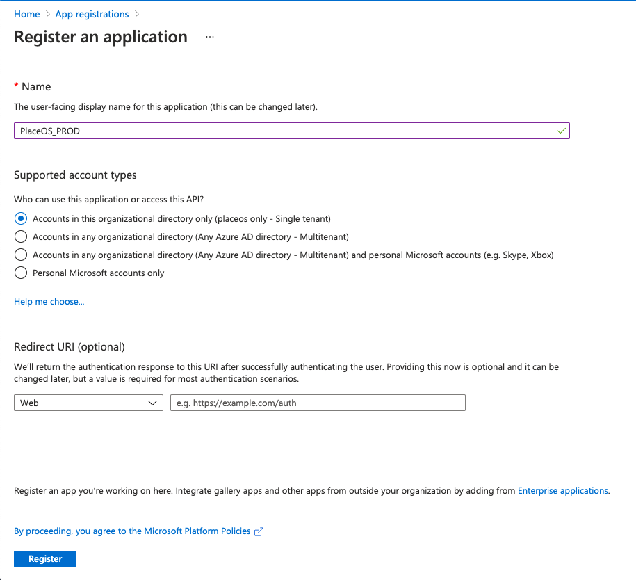
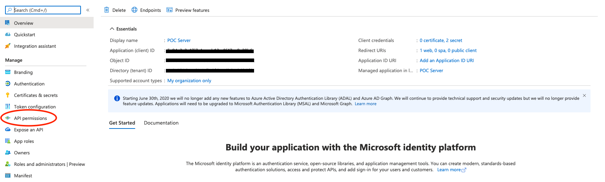
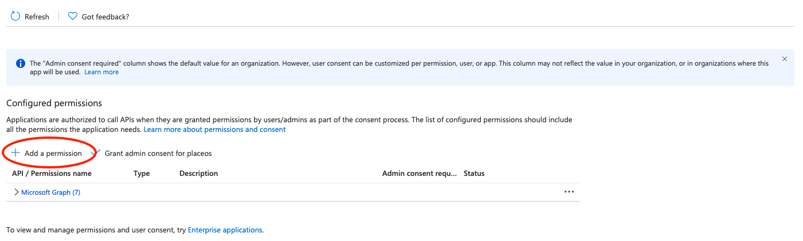
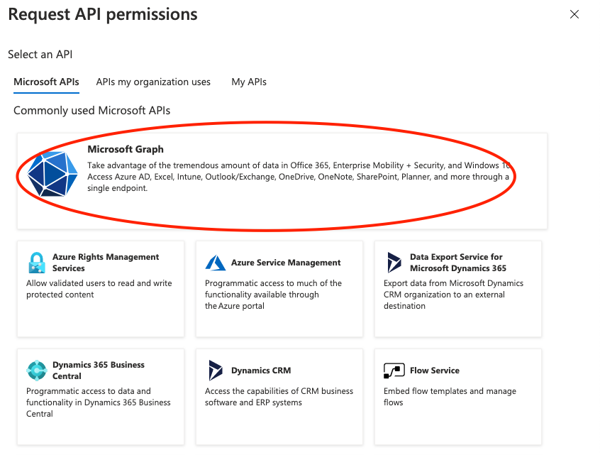
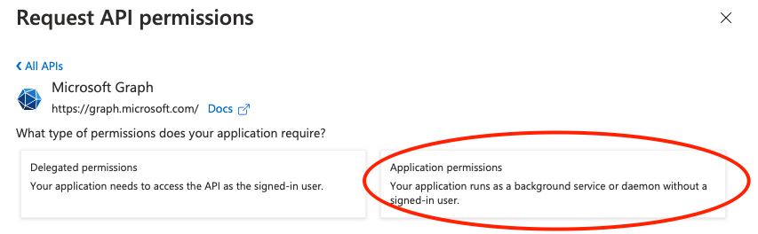
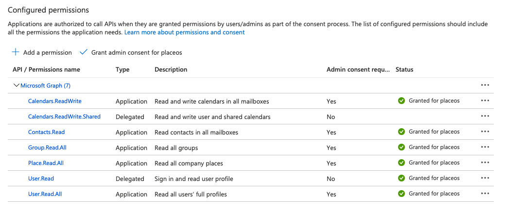

## Prerequisites 

- Access on Microsoft Azure or Google Cloud & Workspace to create apps and API permissions
- Administrator access to your PlaceOS Backoffice

## Configure Providers

<!--tabs start-->
## Microsoft Azure (365)

To use Staff API with 365 you will need to create an Application in App Registration.

You may have already completed this step if you have configured [SAML for Azure](../authentication/configure-saml.md).

If you have already created an app, you ca skip to Grant Graph API Permissions.

If not, you will need to create a new App Registration on Azure.

#### Create Azure App

1. Navigate to the [Azure Portal](https://portal.azure.com)
2. Log in and select the correct Subscription for your application.
3. Navigate to [App Registrations](https://portal.azure.com/#blade/Microsoft_AAD_RegisteredApps/ApplicationsListBlade)
4. Select New Registration
5. Enter the required information
- Name it and select the appropriate "Support Account types" (typically "Single tenant")
- Optionally paste the PlaceOS `Assertion URL` (generated in Step 1 of [Configuring PlaceOS for SAML2](../authentication/configure-saml.md))  

6. Register the app

#### Grant Graph API Permissions

You will now need to grant Graph API Permissions on your App.

1. Select the app you would like to give permissions.
2. Click API Permissions

3. Click Add Permission

4. Click Microsoft Graph

5. Select Application permissions

6. Grant API Access to the following resources:
- `Calendars.ReadWrite`
- `Calendars.ReadWrite.Shared`
- `Contacts.Read`
- `Group.Read.All`
- `User.Read.All`
- `Place.Read.All`

7. Click Add Permissions

#### Generate Azure API Secret

# Google Workspace

Google Workspace

<!--tabs end-->

## Configure Staff API on PlaceOS

You will now need to enter the information obtained from the App Registration and API permissions in the previous step.

## Test Staff API Configuration

Test the configuration