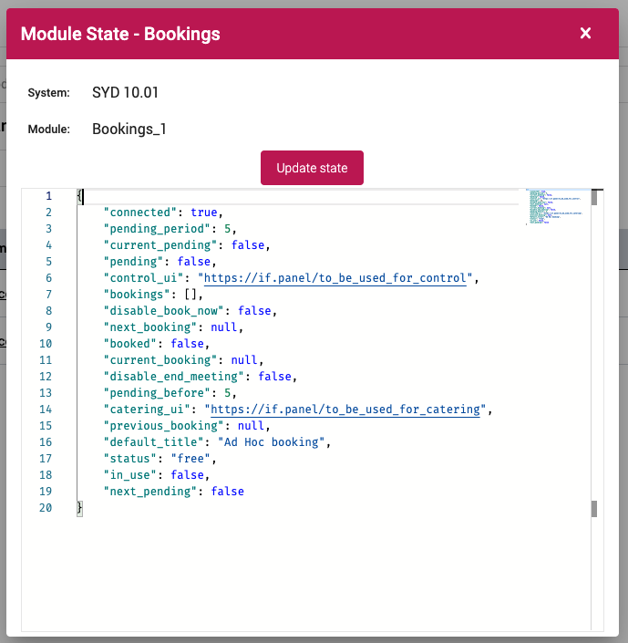

The primary purpose of the Bookings Driver is to enable room booking panels, kiosks and space maps.

Best practice is to add the Bookings Driver to every system on PlaceOS that supports room booking.

## Prerequisites 

- Administrator access to your PlaceOS Backoffice
- PlaceOS Drivers Repository Configured in Backoffice 
- Systems have a valid calendar resource address from Microsoft 365 or Google Workspace
<!-- TODO Link to Add Respository Doc after Merge -->

## Add Driver

Before we can use the PlaceOS Bookings Driver we must instantiate it as a driver.

1. Navigate to the Drivers tab
2. Click the `+` icon to add a new driver
3. Select `PlaceOS Drivers` Repository
4. Select the `drivers > place > bookings.cr` Driver Base
5. Select the latest commit
6. Click Save  

## Add to Systems

You need to instantiate a single instance of the PlaceOS Bookings Driver in each system that has a bookable space.

## Test Module

You can test by creating a booking and inspecting the state of the Bookings Driver.

Inspecting the state will return a JSON response of all bookings for that systems calendar resource.

In the example below, you will see a positive response, but the room resource has no bookings.

  
