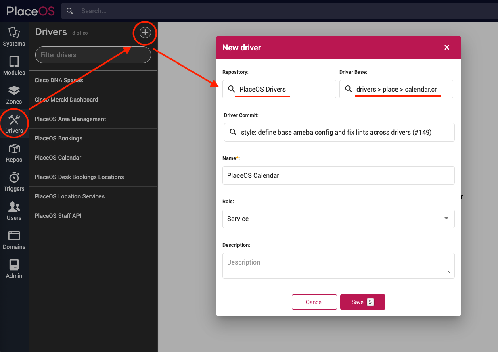
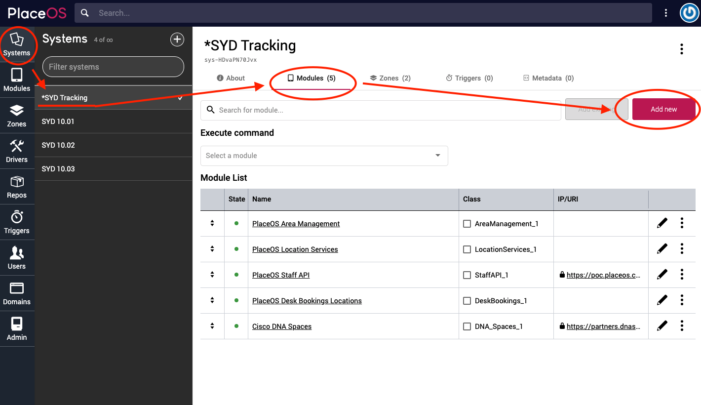
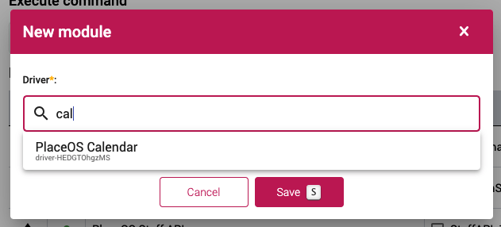
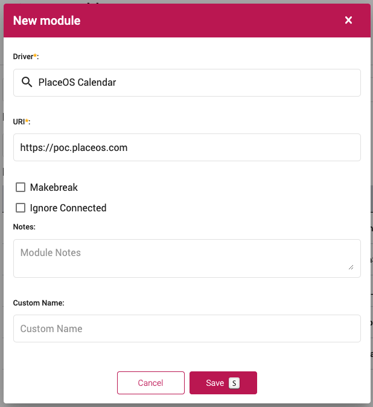
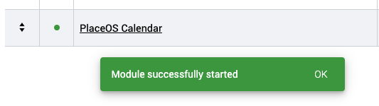
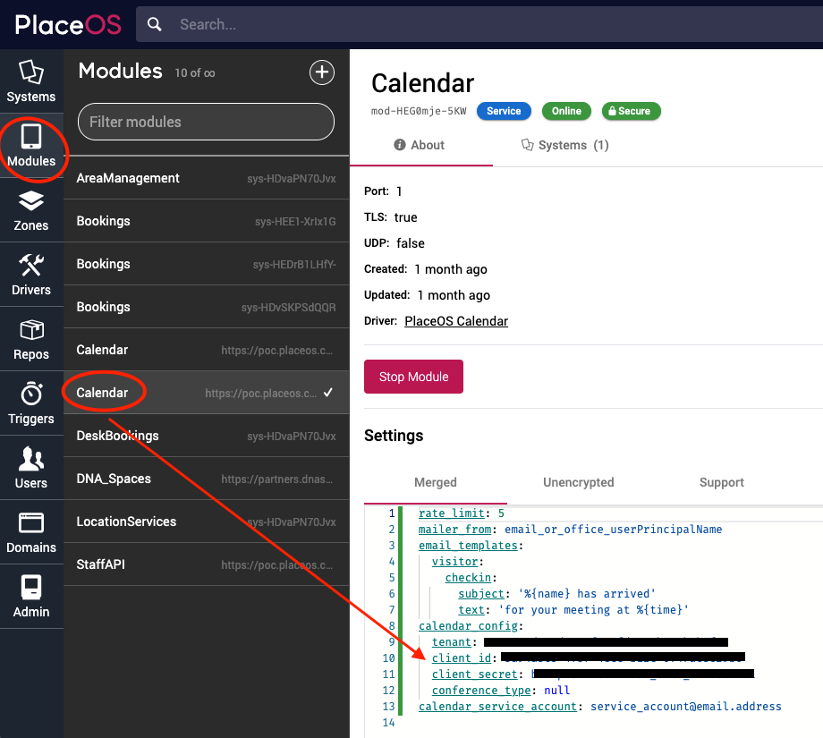
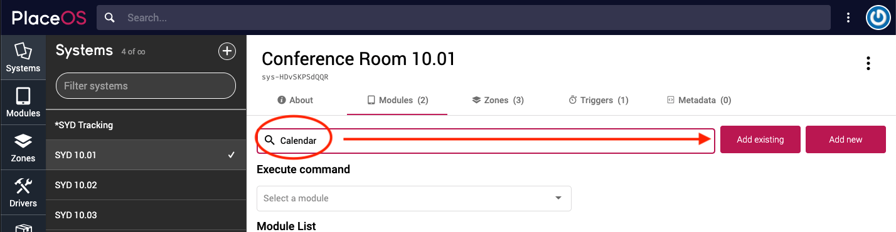
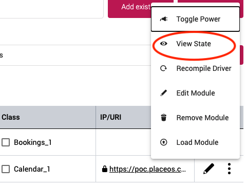
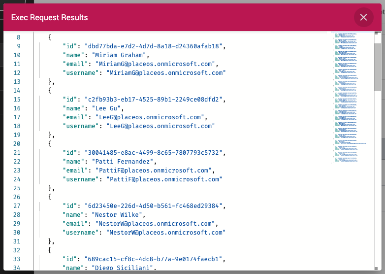

The PlaceOS Calendar Driver connects to Microsoft Graph API (365) or Google Workspace.

The Calendar Driver is used by the [Bookings Driver](./placeos-bookings.md) to obtain resource calendar events.

The Calendar Driver can also make ad-hoc bookings from kiosks or room booking panels.

## Prerequisites 

- Administrator access to your PlaceOS Backoffice
- PlaceOS Drivers Repository Configured in Backoffice

## Add Driver

Before we can use the PlaceOS Calendar Driver we must instantiate it as a driver.

1. Navigate to the Drivers tab
2. Click the `+` icon to add a new driver
3. Select `PlaceOS Drivers` Repository
4. Select the `drivers > place > calendar.cr` Driver Base
5. Select the latest commit
6. Click Save
  

## Add to System

You need to instantiate a single instance of the PlaceOS Calendar Driver.

We recommend instantiating the driver in a generic system e.g. `*Tracking`.

That module is then added to each system that requires booking or calendar functionality.

### Instantiate the Driver

1. Navigate to the system you will instantiate the driver in
2. Select the `Modules` tab
3. Click `Add New`  
  
4. Search for the PlaceOS Calendar driver  
  
5. Click Save  
  
6. Enable the driver by clicking the black dot, it should turn green  
  

### Configure Driver

The driver is now instantiated as a module, we need to configure the API Credentials.

1. Navigate to the Modules tab
2. Select the Calendar Driver
3. In the Settings view select `Unencrpyed`
4. Enter your API information for Microsoft Azure or Google Workspace
  

### Add Module to Systems

You can now add the module to other systems as required.

1. Navigate to an existing system
2. Select the `Modules` tab
3. From the drop down, select the Calendar Module
4. Click `Add Existing`
  

## Test Module

You can test by creating a booking or inspecting the state of the Calendar Driver.

Inspecting State should return a valid response.

 

This should return:
```yaml
{
    "connected": true
}
```

You can also execute a function on the module and view the response.

As a test, executing the `list_users` function should return a list of users if connected properly.

 
