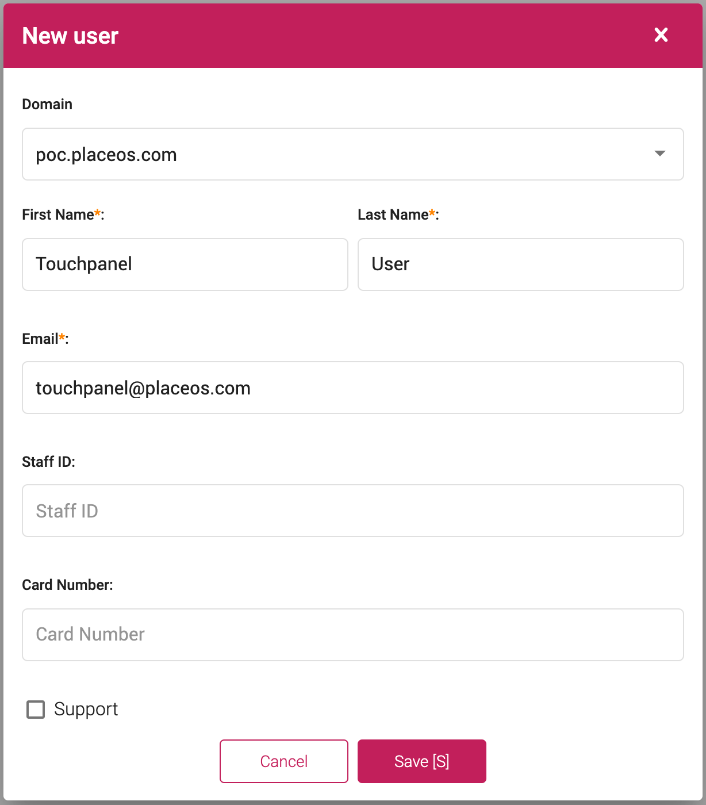

By default, PlaceOS requires users to authentication against frontend applications (Workplace, Kiosks, Concierge etc.).
Endpoint Auto Login allows you to configure panels to authenticate against PlaceOS Automatically. 
This removes the requirement for users to manually enter credentials to authenticate the application.
This feature is most commonly used with unattended user interfaces, such as map and visitor kiosks.  

## Prerequisites
1. Confirm the final UAT and PROD URLs of the web apps
2. Ensure that the **DNS** entries for these URLs are active and forwarding to the server(s)
3. Ensure that the SSL certificates for the above domains are signed and recognized as secure

## Step 1: Create a local user account

1. Login as an admin to Backoffice
2. On the **Users** click **Add new**
3. Enter the required information, including a descriptive username (e.g. `Touchpanel User`)
4. Enter an email address (this does not need to be an active address)
5. Enter a strong password

## Step 2: Encode Username and Password

In this step, you will encode the touch panel users email address and password into a base64 string.
This can be done via a base64 encoding service such as [base64 Encoder](https://www.base64encode.net/). 

1. Encode the users email and password in the following format: `u=touchpanel@placeos.com&p=123456`
2. Once encoded, the above example will be: `dT10b3VjaHBhbmVsQHBsYWNlb3MuY29tJnA9MTIzNDU2`

## Step 3: Construct URL for Applications

To allow the endpoint auto login to work, construct the URL using the encoded credentials. 

1. The first part of the URL will be your PlaceOS domain followed by the `login/unattended.html?` path. For example: `https://PLACEOS.DOMAIN/login/unattended.html?`
2. Now add the encoded credentials: `https://PLACEOS.DOMAIN/login/unattended.html?u=dT10b3VjaHBhbmVsQHBsYWNlb3MuY29tJnA9MTIzNDU2`
3. Finally, add the path to the desired application, for an AV control application this would be: `https://PLACEOS.DOMAIN/login/unattended.html?u=dT10b3VjaHBhbmVsQHBsYWNlb3MuY29tJnA9MTIzNDU2&continue=/control/`

### Escaping Characters

If there are additional query parameters in the URL after `#` then they will need to be [URL encoded](https://www.urlencoder.org/).

This is common where you need to enable the interface to go directly a specific zone or system for kiosk interfaces.

`?`, `=`, `&` and `#` are the main characters that need to be encoded.

For example the following URL will need to be escaped:

`https://placeos.domain/login/unattended.html?u=dT1zaWduYWdlQHN5ZG5leS5lZHUuYXUmcD1wbGFjZW9zMTIzdXN5ZCM=&continue=/kiosk/#/SYSTEM_ID_GOES_HERE`

This will become:

`https://placeos.domain/login/unattended.html?u=dT1zaWduYWdlQHN5ZG5leS5lZHUuYXUmcD1wbGFjZW9zMTIzdXN5ZCM=&continue=/kiosk/%23/SYSTEM_ID_GOES_HERE`

Following login, this will redirect to:

`https://placeos.domain/kiosk/#/SYSTEM_ID_GOES_HERE`
