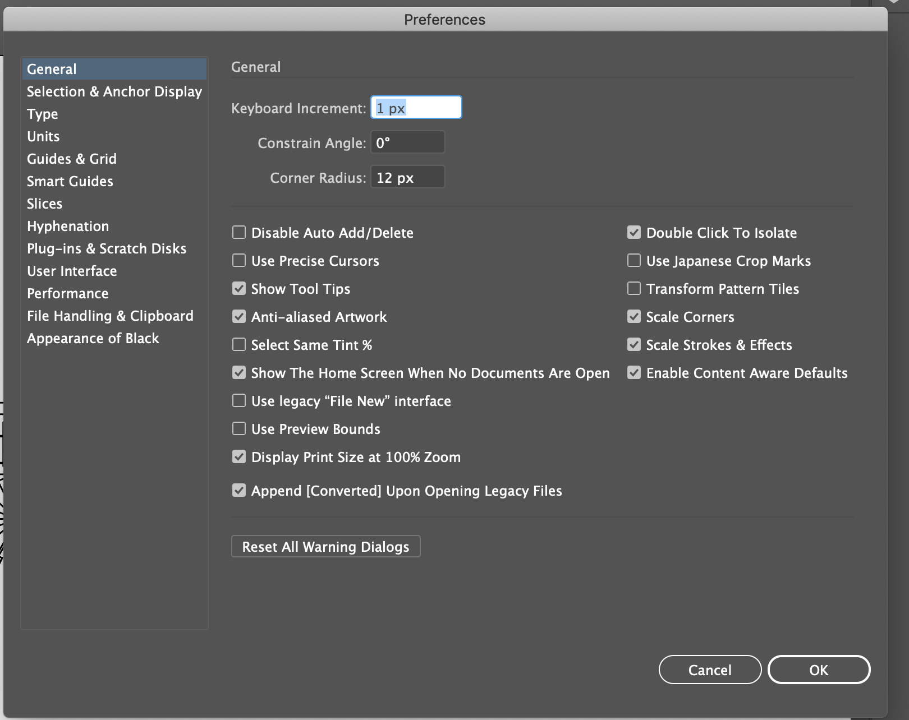
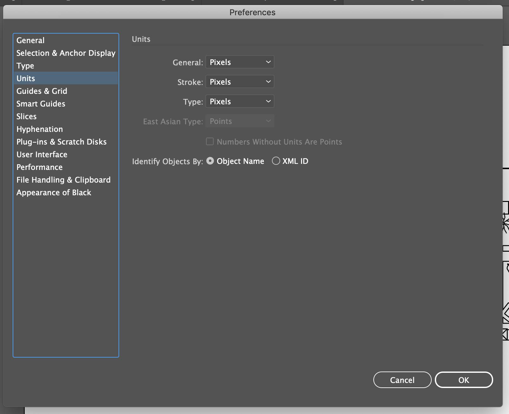
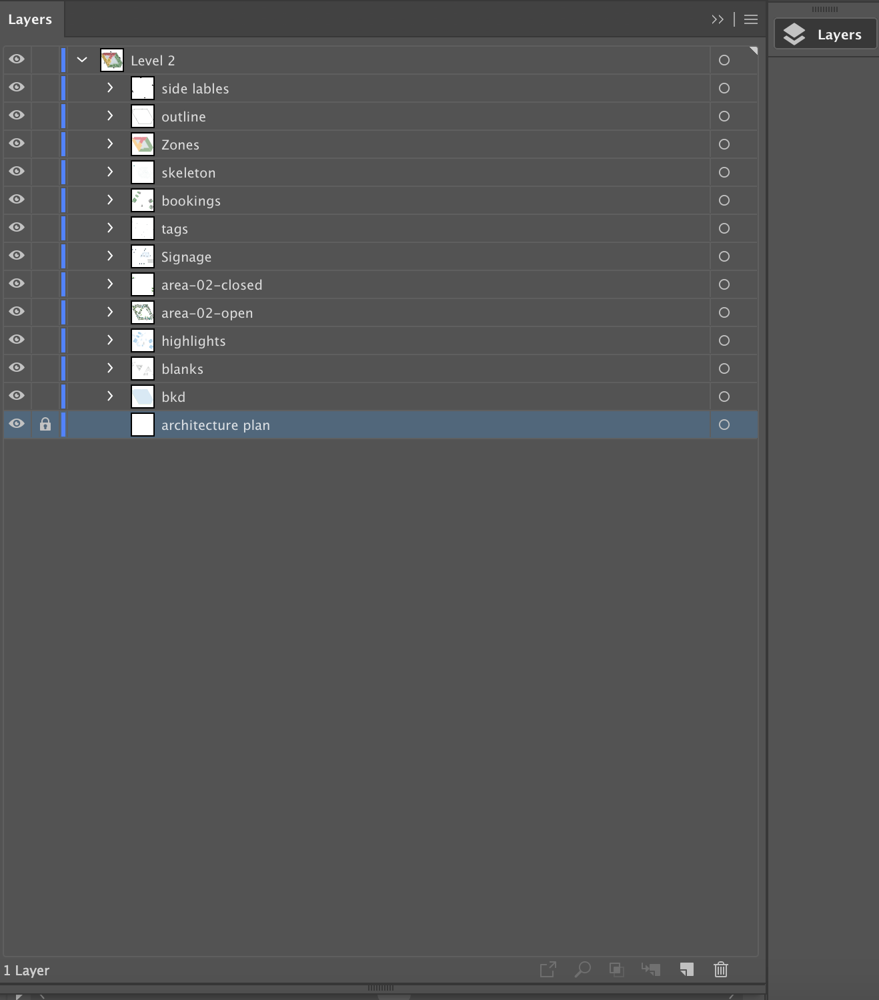
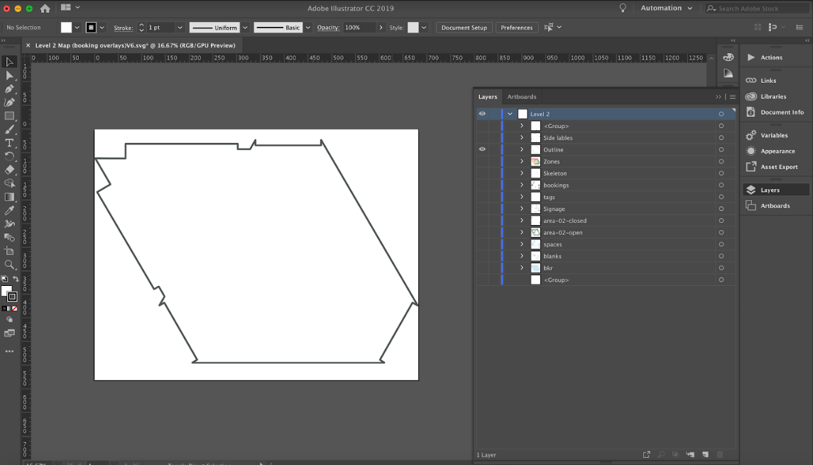
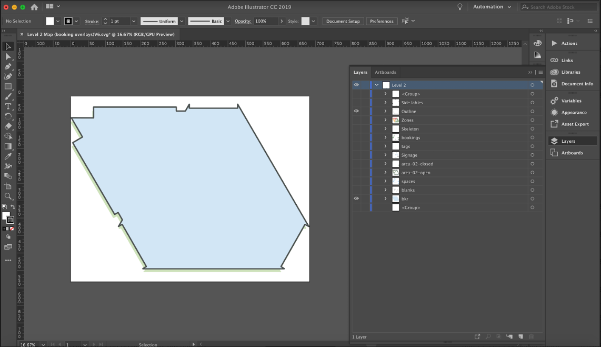
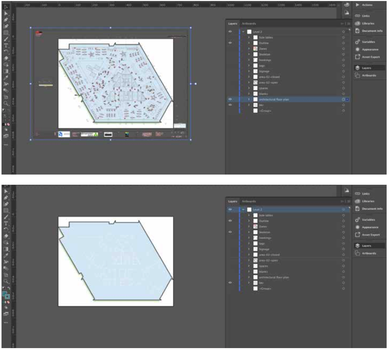
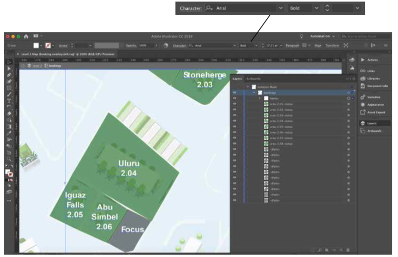
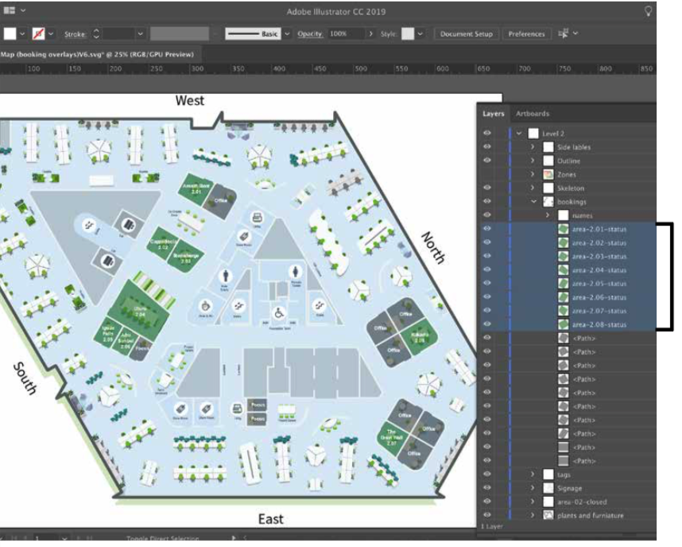
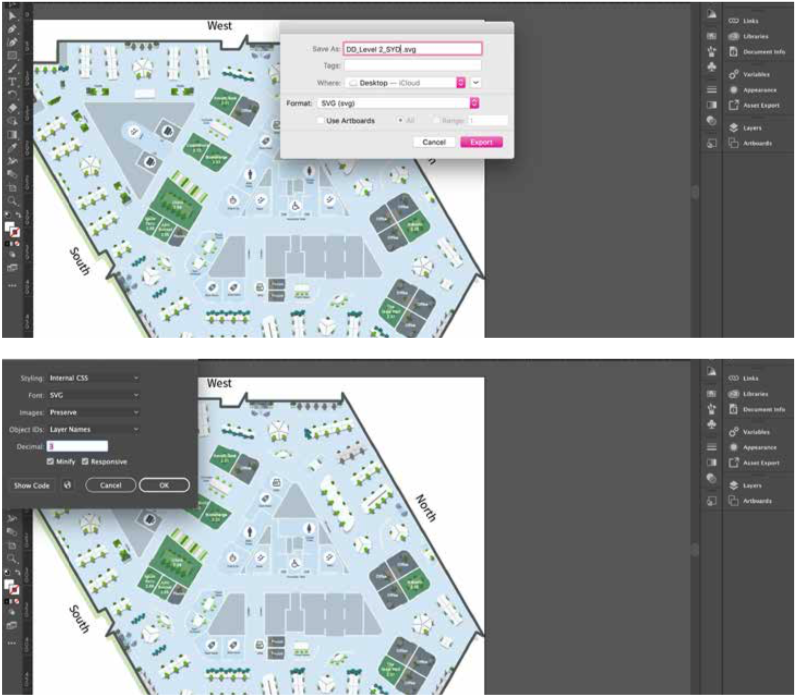

### Intro

Maps are where function meets form, and are the starting point of any conversation between a user and the platform.

A bespoke map is like a tailored suit or custom jewelry piece - you can elevate something simple by perfecting the details which takes the final product to the next level. 
The choices you make along the way will define the story you tell with the finished product. 
This guide will step you through the process in creating a map that is easy to use and visually effective.

When going custom you’ll get to choose from a range of details, which can really elevate your suit to the next level. 
Linings, button colors and stitching choices can all be made. 
This is much like the maps ACA designs for its clients, we take your average engineering map and we give it a makeover to impress the user.

### Step 1 - Obtain Floor Plans

Get architectural floor plan from client and branding colors (if provided).

### Step 2 - File Set Up & Import Architecture Drawing To AI

When working in illustrator it is important to set your artboards to pixels (px) for web form

- Drag drop a JPEG version of the floor plan into AI
- To get started with the right settings we need to select preferences from Illustrator>preferences>General
- Select "scale corners" and "scale strokes and effects" this will make sure all your objects will scale to the stroke you set it at which provides freedom in scalability
- Select "Units" from the Side options and double check everything is set to pixels as we are working in web

*Make sure scale corners and scale strokes and effects are selected.*

*Select "Units" and double check everything is set to "Pixels"*

### Step 3 - Creating Your Layers

Before getting started on design it is important to name and order your layers.  
The ideal way to create layers is to start from the bottom working your way up. 
So for a floor plan that would be to start from the simple features such as the overall skeleton shaping of a building, signage such as toilets, stairs, lifts and lastly adding furniture and room statuses towards the end.

*Original floor plan should be locked to avoid it moving out of place while designing.*

### Step 4 - Creating Floors

In a new layer start outlining your architectural floor plan, fill in shape with color (as outlined by brand guidelines), lock the layer and name layer “outline”

### Step 5 - Floor Dimension

Copy and paste outline and fill in with color (new layer) and lock the layer - name layer “bkd”. 
Ensure this shape is shifted to the side or downward (building shapes vary) to give a shadow or building structure effect to the “outline” layer.

### Step 6 - Outlining Floors aka "The Skeleton"

It is important to note that the floor plan walls and outlines do not need the exact thickness of each wall illustrated. 
The plan needs to define wall areas that are entrances to spaces to rooms . 
The outline shape of the floor should be a little but thicker in point size compared to its inner walls to define boundaries. 

To get started on the skeleton -select the "pen tool" and select a point size that is best to outline walls. 
This can be anywhere from 2px-6px. 
Begin illustrating the custom map ignoring any outlines that are not needed e.g. pipes near bathrooms or electrical rooms can be outlined around and given a darker blank space in its fill.

### Step 7 - Space Highlights

Once rooms have been outlined check the architectural floor plan to see which spaces require signage e.g. rest rooms, stairs or cafe spots. 
These spaces can have a filled space highlight that compliments the background color of the map.

### Step 8 - Compare Floor Plans

To make things easier check the architectural floor plan and begin placing furniture and other features in designated spaces and rooms. 
If you already have them designed, if not you will need to create your own according to the brand guidelines.

### Step 9 - Completing Layers

Make sure furniture and other elements such as plants are proportional to the room size and layout. 
Ensure plants are kept simple and are not composed of a gradient. 
Once complete name layer “plants and furniture”. 
Once complete lock layer.

### Step 10 - Adding Bookable Rooms

In a new layer, using the “rectangle tool” begin create overlay for room bookings (bookable rooms), ensure the over layer is between 40%- 60% black. 
Room layer should be on a layer below lines (for appearances to look neater). 
Name layer “room bookings”.

### Step 11 - Booking IDs

In this layer “room bookings” you will be required to give room ids, usually provided by the client. 
Clients usually give the room ids/ specification to which they would like. 
Capitalized or lower case, room and level number order etc. but all rooms should be labeled according to the following `area- level. room number-status`.

:::tip
IMPORTANT: All IDs MUST start with a LETTER (i.e. must not start with a number or other character). 
This is due to the CSS selector conventions.
:::

### Step 12 - Adding Text

Once each room layer is labeled you can create another layer “text” here you will label each room and section of the map. 
This text should be Arial and anything larger than 6pt text size. 
For rooms use Arial bold or medium for other sections of the map use Arial regular or light. 
Make sure text color is white or a color that stands out against the map background.

### Step 13 - Adding Icons

Lastly, on another layer, add icons to your map, icons should follow the branding guidelines e.g. style, colors, line weight/thickness etc. ensure colors chosen for icons also stand out against the map background.

### Step 14 - Checking Names/ID

Once all elements are on your map go back to the booking layer and be sure to check the name and number of each room. 

We would recommend placing the names in order to ensure there are no double ups. 

Remember the SVG map will not work on the frontend if two rooms have the same ID.

:::tip
IMPORTANT: All IDs MUST start with a LETTER (i.e. must not start with a number or other character). 
This is due to the CSS selector conventions.
:::

### Step 15 - Exporting

Go to File > Export As > SVG > Save to designated folder. 

Ensure the following is correct:

1. Styling > Internal CSS
2. Font > SVG
3. Images > preserve
4. Object IDs > Layer names Decimal > 3
5. Tick > minify and responsive Select > OK

### Checklist

- [ ] Client Architectural floor plans
- [ ] Client room IDs and room names
- [ ] Client/brand guidelines
- [ ] Client/brand color pallet
- [ ] Create furniture and plants that follow client/brand guidelines
- [ ] Have the latest Adobe Illustrator CC2019
- [ ] Name the file `client_map_level`
- [ ] Name layers
- [ ] Save As (Always)
- [ ] Once you complete check room IDs for no duplicates