## Intro

Maps are where function meets form, and are the starting point of any conversation between a user and the platform.

A bespoke map is like a tailored suit or custom jewelry piece. 
You can elevate something plain by perfecting the details which takes the final product to the next level. 
The choices you make along the way will define the story you tell with the finished product. 
This guide will step you through the process in creating a map that is usable and visually effective.

When going custom you’ll get to choose from a range of details, such as linings, button colors and stitching choices.
This is how PlaceOS designs maps for our clients - we take your average engineering map and we give it a makeover to impress the user.

## Step 1 - Get Floor Plans

Get architectural floor plan from client and branding colors (if provided).

## Step 2 - File Set Up & Import Architecture Drawing To Adobe Illustrator

When working in illustrator it's important to set your artboards to pixels (px) for web form.

- Drag drop a JPEG version of the floor plan into Illustrator
- To get started with the right settings, navigate to Illustrator > Preferences > General

- Select "scale corners" and "scale strokes and effects".
 This will ensures all your objects will scale to the stroke you set, which provides freedom in scalability

- Select "Units" from the side options and double check everything is set to pixels as we are working in web

## Step 3 - Creating Your Layers

Before getting started on design it's important to name and order your layers. 
The ideal way to create layers is to start from the bottom working your way up. 
For a floor plan that could mean:  

1. Main features such as the skeleton shape of a building  
2. Signage such as toilets, stairs, lifts  
3. Adding furniture and room statuses

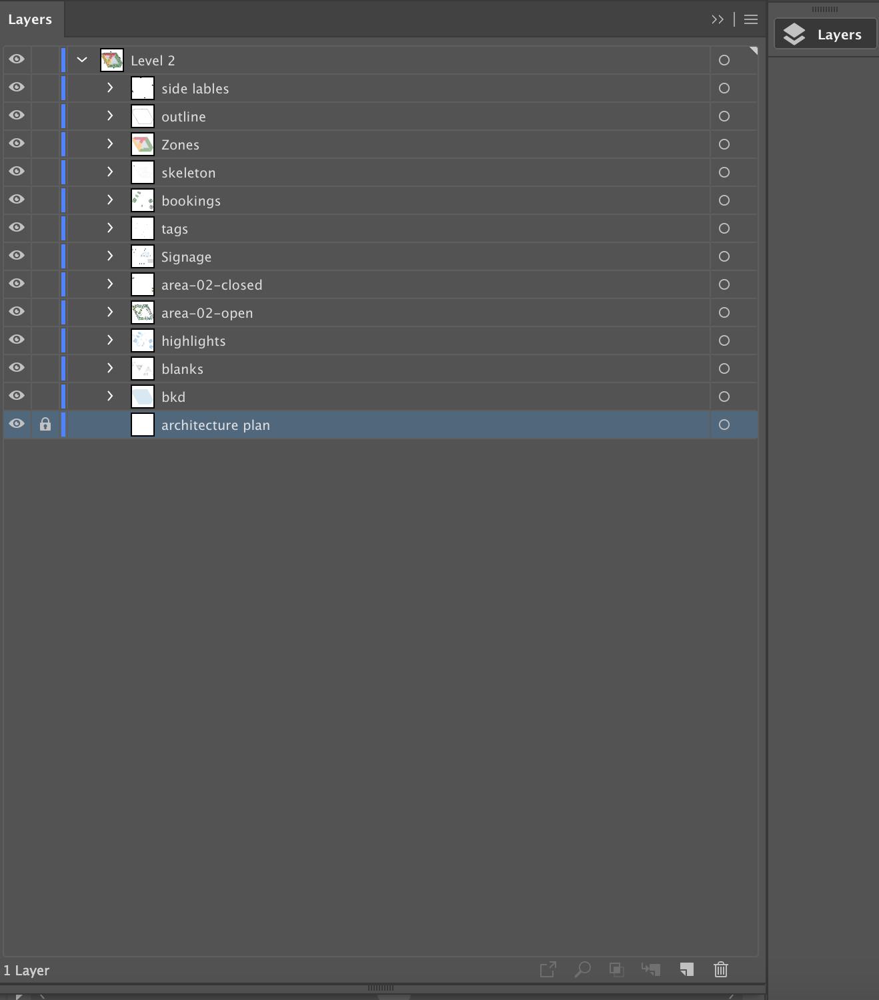
*Original floor plan should be locked to avoid it moving out of place while designing.*

## Step 4 - Creating Floors

In a new layer start outlining your architectural floor plan. 
Fill in the shape with color (as outlined by brand guidelines). 
Lock the layer and name layer “outline”

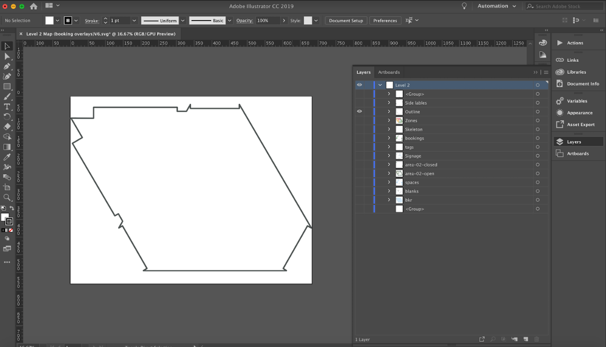

## Step 5 - Floor Dimension

Copy and paste outline and fill in with color (new layer) and lock the layer - name layer <i>“bkd”</i>. 
To give a shadow or building structure effect to the “outline” layer, offset this layer from it.
Shift this shape sideways or downward (building shapes vary).

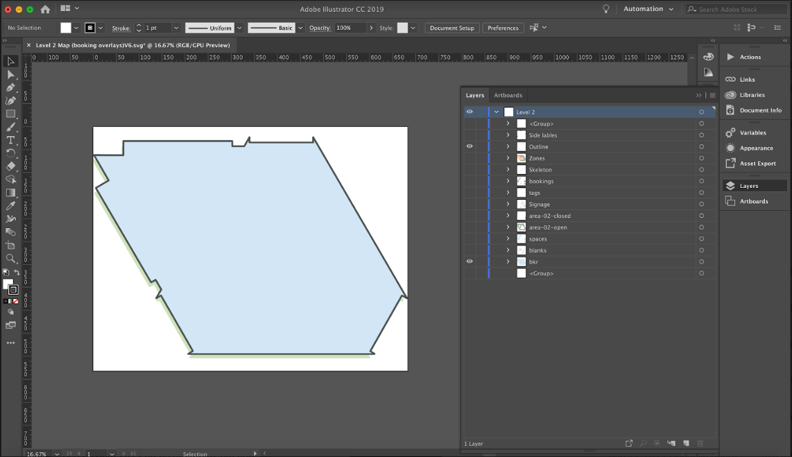

## Step 6 - Outlining Floors aka "The Skeleton"

Note that the floor plan walls and outlines do not need the exact thickness of each wall illustrated. 
The plan needs to define wall areas that are entrances to spaces and rooms. 
The outline shape of the floor should be a little bit thicker in point size compared to its inner walls to define boundaries. 

To get started on the skeleton, select the "pen tool" and select a point size to outline walls. 
This can be anywhere from 2px-6px. 
Begin illustrating the custom map, ignoring any outlines that are not needed. 
For example, pipes near bathrooms or electrical rooms can have a darker blank color fill.

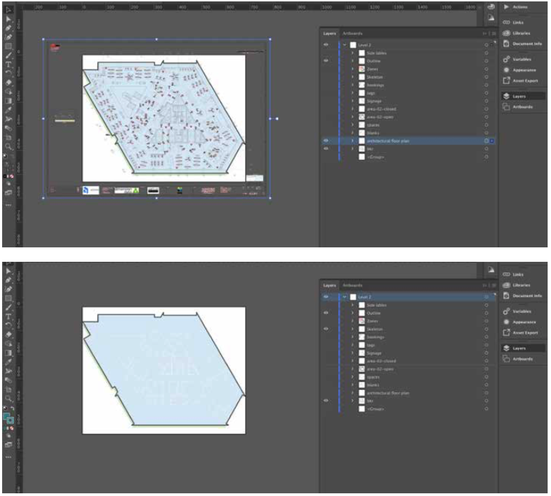

## Step 7 - Space Highlights

Next, check the architectural floor plan to see which spaces need signage e.g. rest rooms, stairs or cafe spots. 
These spaces can have a filled space highlight that compliments the background color of the map.

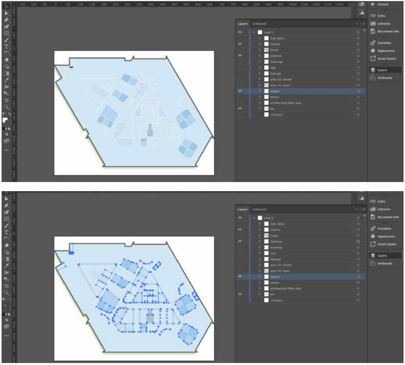

## Step 8 - Compare Floor Plans

Check the architectural floor plan to verify each room. 
Begin placing furniture and other features in designated spaces and rooms on your map. 
You may need to create your own designs according to the brand guidelines.

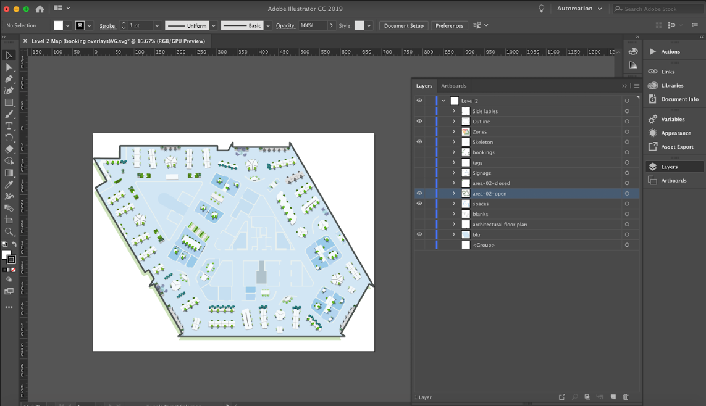

## Step 9 - Completing Layers

Make sure furniture and other elements such as plants are proportional to the room size and layout. 
Ensure plants are block colors and are not composed of a gradient. 
Once complete, lock the layer and name it “plants and furniture”.

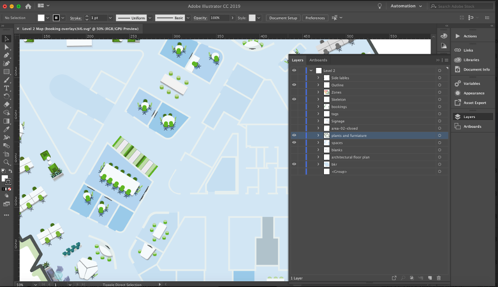

## Step 10 - Adding Bookable Rooms

In a new layer, use the “rectangle tool” to create an overlay for room bookings (bookable rooms).
Ensure the layer is between 40-60% black. 
This layer should be on a layer below lines (for appearances to look neater). 
Name layer “room bookings”.

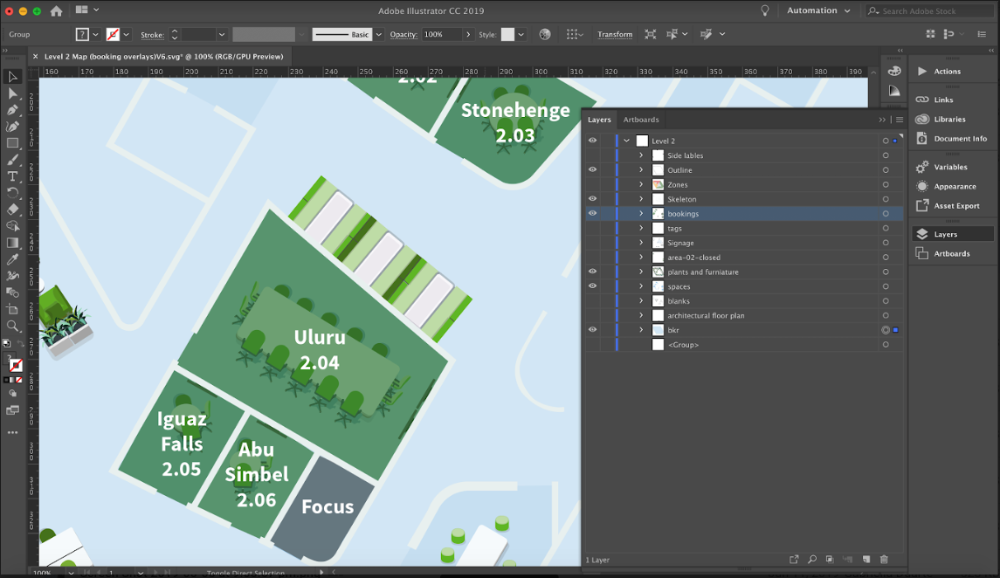

## Step 11 - Booking IDs

In the layer “room bookings” you will need to write room IDs. 
Clients may give room ID specifications, such as capitalized vs lower case, order of room/level number, etc.
Generally, room labels should be in the following format: `area-[level].[room number]-status`.

:::tip IMPORTANT  
All IDs MUST start with a **letter** (i.e. must not start with a number or other character). 
This is due to the CSS selector conventions.
:::

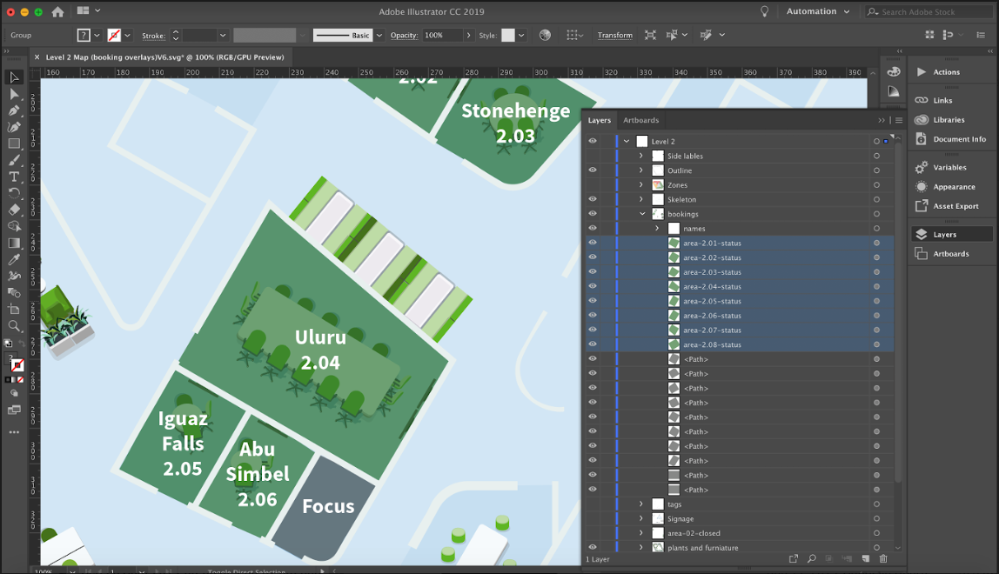

## Step 12 - Adding Text

Once you have labeled each room layer, you can create another layer “text”. 
On it, you will label each room and section of the map. 
This text should be Arial and anything larger than 6pt text size. 
For rooms use Arial bold or medium for other sections of the map use Arial regular or light. 
Make sure text is a color that stands out against the map background. 
You can check that this is accessible with a [contrast checker](https://webaim.org/resources/contrastchecker/).

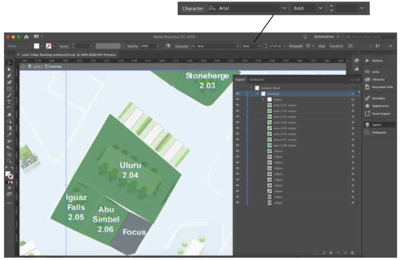

## Step 13 - Adding Icons

On the final new layer, add icons to your map. 
Icons should follow the branding guidelines e.g. style, colors, line weight/thickness etc. 
Ensure colors chosen for icons also stand out against the map background.

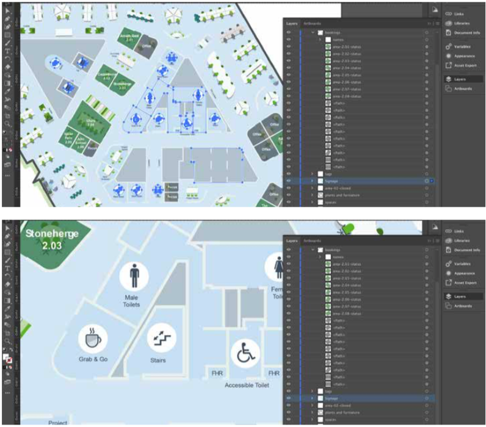

## Step 14 - Checking Names/ID

Once all elements are on your map go back to the booking layer and be sure to check the name and number of each room. 
We recommend placing the names in order, to ensure there are no double ups. 
Remember the SVG map will not work on the frontend if two rooms have the same ID.

:::tip IMPORTANT  
All IDs MUST start with a **letter** (i.e. must not start with a number or other character). 
This is due to the CSS selector conventions.
:::

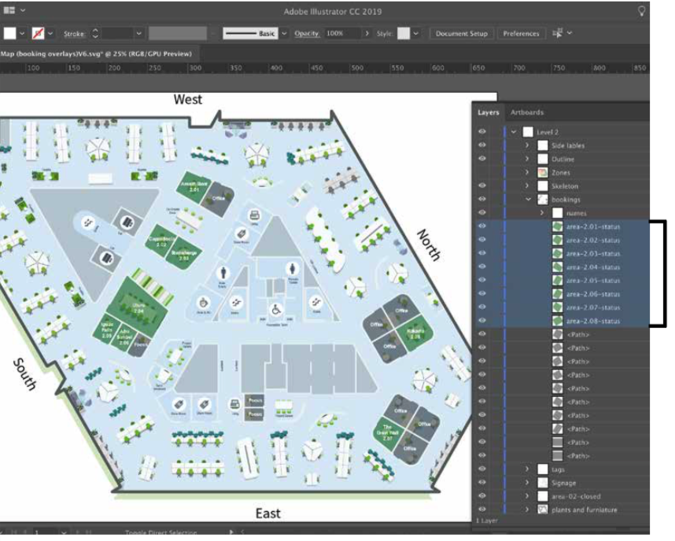

## Step 15 - Exporting

Go to File > Export As > SVG > Save to designated folder. 

Ensure the following is correct:

1. Styling > Internal CSS
2. Font > SVG
3. Images > preserve
4. Object IDs > Layer names Decimal > 3
5. Tick <i> "minify" </i> and "responsive"
6. Select "OK"

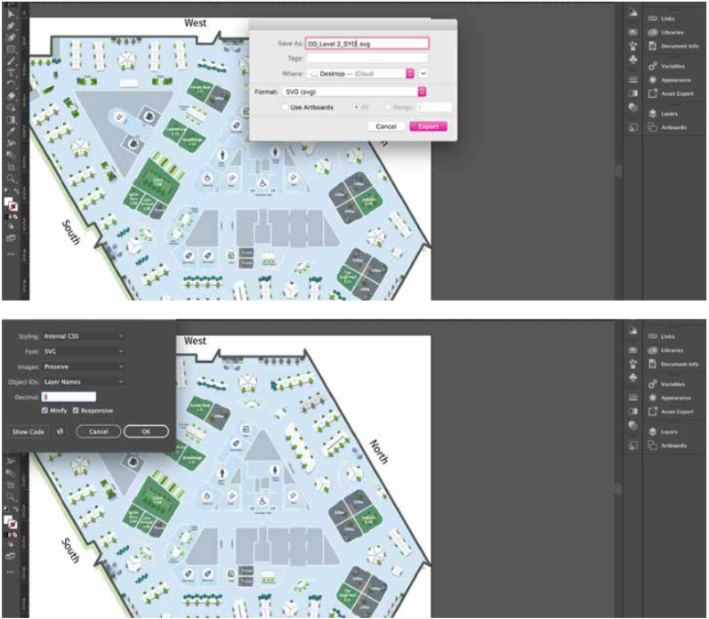

## Checklist

- [ ] Client Architectural floor plans
- [ ] Client room IDs and room names
- [ ] Client/brand guidelines
- [ ] Client/brand color pallet
- [ ] Furniture and plants that follow client/brand guidelines
- [ ] Have the latest Adobe Illustrator CC2019
- [ ] Name the file `client_map_level`
- [ ] Name layers
- [ ] Save As (Always)
- [ ] Once complete, check room IDs for no duplicates