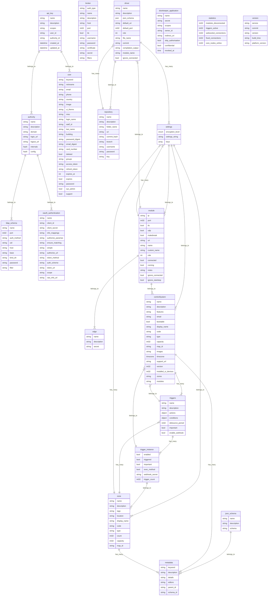

```mermaid
erDiagram
    api_key ||--|{ authority : belongs_to
    api_key ||--|{ user : belongs_to
    api_key {
        string name
        string description
        string scopes
        string user_id
        string authority_id
        datetime created_at
        datetime updated_at
    }
    authority ||--|{ ldap_schema : belongs_to
    authority ||--|{ oauth_authentication : belongs_to
    authority {
        string name
        string description
        string domain
        string login_url
        string logout_url
        hash internals
        hash config
    }
    broker {
        string auth_type
        string name
        string description
        string host
        int32 port
        bool tls
        string username
        string password
        string certificate
        string secret
        string filters
    }
    driver ||--|{ repository : belongs_to
    driver ||--|{ settings : has_many
    driver {
        string name
        string description
        json json_schema
        string default_uri
        int32 default_port
        int role
        string file_name
        string commit
        string compilation_output
        string module_name
        bool ignore_connected
    }
    doorkeeper_application {
        string name
        string secret
        string scopes
        string owner_id
        string redirect_uri
        bool skip_authorisation
        bool confidential
        time revoked_at
    }
    edge {
        string name
        string description
        string secret
    }
    json_schema ||--|{ metadata : belongs_to
    json_schema {
        string name
        string description
        string schema
    }
    user {
        string keyword
        string nickname
        string email
        string phone
        string country
        string image
        string ui_theme
        string misc
        string login_name
        string staff_id
        string last_name
        string building
        string password_digest
        string email_digest
        string card_number
        bool deleted
        string groups
        string access_token
        string refresh_token
        int expires_at
        bool expires
        string password
        bool sys_admin
        bool support
    }
    settings ||--|{ controlSystem : belongs_to
    settings ||--|{ module : belongs_to
    settings ||--|{ zone : belongs_to
    settings {
        enum encryption_level
        string settings_string
        array keys
    }
    controlSystem ||--|{ metadata : has_many
    controlSystem ||--|{ triggers : has_many
    controlSystem {
        string name
        string description
        string features
        string email
        bool bookable
        string display_name
        string code
        string type
        int32 capacity
        string map_id
        string images
        timezone timezone
        string support_url
        int32 version
        int32 installed_ui_devices
        string zones
        string modules
    }
    module ||--|{ controlSystem : belongs_to
    module ||--|{ driver : belongs_to
    module ||--|{ edge : belongs_to
    module ||--|{ settings : has_many
    module {
        string ip
        int32 port
        bool tls
        bool udp
        bool makebreak
        string uri
        string name
        string custom_name
        int role
        bool connected
        bool running
        string notes
        bool ignore_connected
        bool ignore_startstop
    }
    repository ||--|{ driver : has_many
    repository {
        string name
        string description
        string folder_name
        string uri
        string commit_hash
        string branch
        string username
        string password
        string key
    }
    zone ||--|{ triggers : has_many
    zone ||--|{ metadata : has_many
    zone ||--|{ settings : has_many
    zone {
        string name
        string description
        string tags
        string location
        string display_name
        string code
        string type
        int32 count
        int32 capacity
        string map_id
    }
    triggers ||--|{ controlSystem : belongs_to
    triggers ||--|{ trigger_instance : has_many
    triggers {
        string name
        string description
        object actions
        object conditions
        int32 debounce_period
        bool important
        bool enable_webhook
    }
    metadata {
        string keyword
        string description
        string details
        string editors
        string parent_id
        string schema_id
    }
    ldap_schema {
        string name
        int32 port
        string auth_method
        string uid
        string host
        string base
        string bind_dn
        string password
        string filter
    }
    oauth_authentication {
        string name
        string client_id
        string client_secret
        string info_mappings
        string authorize_paramas
        string ensure_matching
        string simple
        string authorize_url
        string token_method
        string auth_scheme
        string token_url
        string scope
        string raw_info_url
    }
    statistics {
        int32 modules_disconnected
        int32 triggers_active
        int32 websocket_connections
        int32 fixed_connections
        int32 core_nodes_online
    }
    trigger_instance ||--|{ controlSystem : belongs_to
    trigger_instance ||--|{ zone : belongs_to
    trigger_instance {
        bool enabled
        bool triggered
        bool important
        bool exec_method
        string webhook_secret
        int32 trigger_count
    }
    version {
        string service
        string commit
        string version
        string build_time
        string platform_version
    }
```