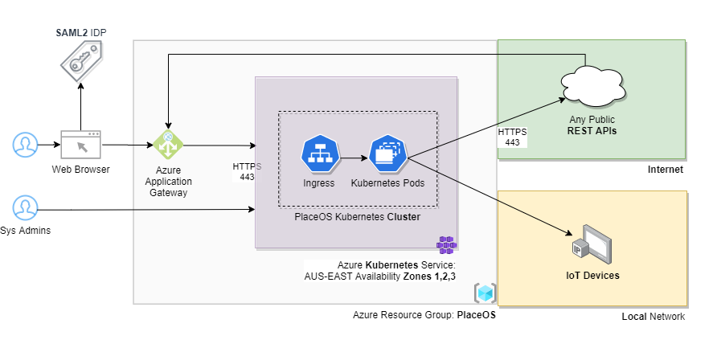

<!-- source material gospel at https://docs.google.com/document/d/1kzQpnI_nTEUq_Qe5RApV6AkrRsqIUCyKsoPVirCt7bs/edit#heading=h.69jrquo1axlr -->

<!-- The diagrams are a placeholder. Ideally implement with Mermaid.js or equivalent. They look bad in dark theme. -->

## Service Architecture
High level network diagram of an implementation orchestrated via Kubernetes on Azure

## Microservices running in PlaceOS Kubernetes Cluster {#microservices}
PlaceOS service integrators and support partners manage these microservices.
They work in different combinations to best suit the needs of each site.

<!-- See the [Docker Image]() and [Source on GitHub](). -->

Service|Description|Reference
---|---|---
ingress|Serves web requests (static files and upstream reverse proxying to REST-API). |[Docker Image](https://hub.docker.com/r/yobasystems/alpine-nginx)   [Github Source](https://GitHub.com/nginx/nginx)

### ingress
 Serves web requests (static files and upstream reverse proxying to REST-API).  
 See the [Docker Image](https://hub.docker.com/r/yobasystems/alpine-nginx) and [Source on GitHub](https://GitHub.com/nginx/nginx).

### etcd
 Distributed key-value store used for PlaceOS service discovery and leader election.  
 See the [Docker Image](https://hub.docker.com/r/bitnami/etcd) and [Source on GitHub](https://GitHub.com/etcd-io/etcd).

### RethinkDB
 Database for permanent storage of PlaceOS configuration. 
 Configuration: Three node cluster in 3 different availability zones within same region for HA.  
 See the [Docker Image](https://hub.docker.com/_/rethinkdb) and [Source on GitHub](https://GitHub.com/rethinkdb/rethinkdb).

### PlaceOS core
 Application in a Docker container that interfaces with external devices/services.  
 See the [Docker Image](https://hub.docker.com/r/placeos/core) and [Source on GitHub](https://GitHub.com/PlaceOS/core).

### PlaceOS auth
 Application in a Docker container that provides authentication.  
 See the [Docker Image](https://hub.docker.com/r/placeos/auth) and [Source on GitHub](https://GitHub.com/PlaceOS/auth).

### PlaceOS REST-API
 Application in a Docker container that provides REST API for web applications.  
 See the [Docker Image](https://hub.docker.com/r/placeos/rest-api) and [Source on GitHub](https://GitHub.com/PlaceOS/rest-api).

### PlaceOS triggers
 Perform user defined actions, without code, under certain conditions.  
 See the [Docker Image](https://hub.docker.com/r/placeos/triggers) and [Source on GitHub](https://GitHub.com/PlaceOS/triggers).

### PlaceOS dispatch
 Reverse proxy incoming communications from devices/services to PlaceOS core. 
 This is required to handle protocols like SNMP Traps - often not required.  
 See the [Docker Image](https://hub.docker.com/r/placeos/dispatch) and [Source on GitHub](https://GitHub.com/PlaceOS/dispatch).

### PlaceOS rubber-soul
 Stream RethinkDB changes to Elasticsearch, which will index the documents for fast text searching.  
 See the [Docker Image](https://hub.docker.com/r/placeos/rubber-soul) and [Source on GitHub](https://GitHub.com/PlaceOS/rubber-soul).

<!-- nothing below here has been substantially rewritten -->

## High Availability and Distributed Control
High availability works by distributing services through Availability Zones. 
For platforms like AWS Fargate, containers are initially automatically distributed.
If a zone becomes unavailable, containers are re-launched in an alternative Availability Zone.

<!-- possibly just link, here, maybe even push this stuff over to #key-concepts -->
[Driver stuff](overview/drivers.md#Integration-Drivers)
### Definitions
**Driver:** Code that defines how PlaceOS interacts with an integration, and what data it provides.
- Drivers exist as files inside the PlaceOS core containers
- Drivers are managed by the PlaceOS Backoffice web application which interfaces via PlaceOS REST-API
- PlaceOS Core creates a separate process for Driver in use, which will serve all the Modules (instances) of this Driver
  - Modules are distributed among the instances of core

**Module:** An instance of a Driver, that represents a single real-world device/service. 
Essentially a “digital twin” of that external device, or a client to that external service.
- Modules exist in memory in the PlaceOS core containers
- Modules are managed by the PlaceOS Backoffice web application which interfaces via PlaceOS REST-API
The REST-API service updates module config via RethinkDB
- Modules reflect their runtime state in Redis, making it widely available for other components of the system

### Service Discovery 
Instances of PlaceOS Core advertise (with a short TTL expiry) their existence to an etcd cluster as they come online. 
They also query etcd to discover other active instances. 
Each service continues to advertise it’s existence with the short TTL while they are online. 
If a service is offline, it’s entry in etcd will automatically be removed after the TTL expires. 
Interested services are made aware of any changes to the cluster so it can rebalance.

### Distribution of Modules across multiple Cores
Module distribution across multiple instances of active PlaceOS Cores is determined by rendezvous hashing. 
All Cores will push runtime Module state to Redis where other components of the system can access it and the state can persist the availability of the Core. 
When a Core goes online/offline, rendezvous hashing determines the new distribution.

*[SSO]: Single Sign On
